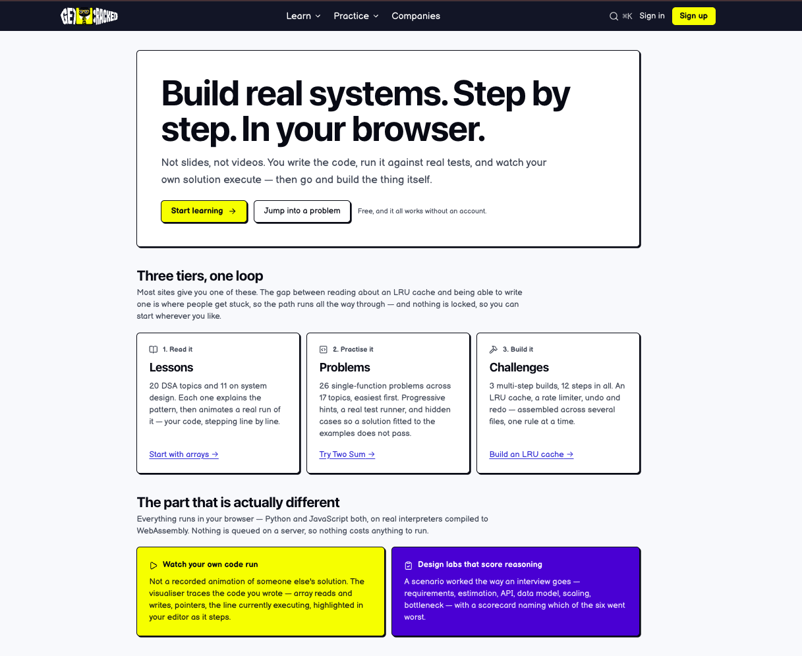

# GetCracked

<!-- Technology stack badges (informational) -->
[](https://nextjs.org/)
[](https://reactjs.org/)
[](https://www.typescriptlang.org/)
[](https://nodejs.org/)


<p align="center">
  
</p>

> Build real systems. Step by step. In your browser.

GetCracked is an interactive learning platform for data structures, algorithms, system design, and interview preparation. Instead of passive videos or static theory, learners write real code, run it against tests, and watch the execution animate in the browser.

The project is built around a simple idea: understanding comes from doing. Learners can read a concept, practice it in a focused problem, and then build a more complete system in a guided lab.

## Why GetCracked?

Most prep platforms stop at either content or questions. GetCracked combines all three:

- Lessons that explain the pattern and animate the execution
- Interview-style practice problems with real test validation
- Multi-step build challenges for real-world systems and design work
- A free, open approach where learning is not blocked behind sign-up or paywalls

## AI Assistant

An integrated AI Assistant provides Socratic, code-review, and debugging help from within the learning UI. Key points:

- The assistant opens as a slide-out panel (right side) that animates in and out and overlays the page content.
- Branding uses the project's assistant SVG located in `public/getcracked_assistant.svg` and consistent trigger buttons across the site.
- Quick prompts include common requests (hints, debugging, complexity, code review) with accessible icons.
- The theme toggle is intentionally placed under slide-out panels so it is covered while panels are open.
- The assistant panel respects reduced-motion preferences and traps focus while open.

Developer notes — verifying the Assistant locally:

1. Start local services and dev server:

```bash
pnpm install
pnpm services:up
pnpm dev
```

2. Open the site at `http://localhost:3000`, open the Assistant using the floating trigger, and verify:

- Panel slides in/out smoothly and is dismissible by clicking the scrim or pressing `Escape`.
- The assistant image renders cleanly (no decorative borders).
- Quick prompts show icons and send example messages.

If you want the assistant to animate on programmatic close as well, update `AssistantContext.closeAssistant` to trigger the panel's closing state.

## Product overview

The experience is intentionally structured as a loop:

1. Learn the concept
2. Practice the technique
3. Build the system
4. Repeat with deeper topics and larger constraints

This keeps the platform approachable for beginners while still giving more experienced engineers a direct route to harder material.

## Screenshots

<p align="center">
  
</p>

## Core features

- Animated DSA and system-design learning paths
- Real coding exercises with browser-based execution
- JavaScript and Python support through WASM-powered runtimes
- Guided build challenges across multiple steps
- Company-oriented interview preparation and curriculum organization
- Searchable content and structured learning tracks for scaling knowledge

## Tech stack

- Next.js 16
- React 19
- TypeScript
- Tailwind CSS
- Vitest for testing
- Drizzle ORM + Postgres
- Redis and Docker for local services
- Pyodide and QuickJS for in-browser execution

## Quick start

Requirements:

- Node.js 22+
- pnpm
- Docker

```bash
pnpm install
pnpm services:up
pnpm db:migrate
pnpm db:seed
pnpm dev
```

Then open <http://localhost:3000>.

## Useful commands

```bash
pnpm dev                # run the app locally
pnpm build              # production build
pnpm test               # run the test suite
pnpm test:watch         # run vitest in watch mode
pnpm lint               # lint the project
pnpm typecheck          # TypeScript type check
pnpm db:generate        # generate Drizzle migrations
pnpm db:migrate         # apply migrations
pnpm db:studio          # inspect database locally
pnpm services:up        # start Docker services
pnpm services:down      # stop Docker services
pnpm services:reset     # reset Docker data and restart
pnpm db:setup           # start services, migrate, and seed
```

## Local services

The application uses Dockerized local equivalents of the managed services used in production. This keeps development isolated and avoids port conflicts with other local projects.

| Service | Local port | Notes |
| --- | ---: | --- |
| Postgres | 5433 | Primary application database |
| Redis | 6380 | Caching and future async workloads |
| Redis HTTP proxy | 8080 | Local compatibility for REST-based Redis access |

## Repository structure

```text
getcracked/
├── src/                     # application code
│   ├── app/                 # Next.js routes and pages
│   ├── components/          # UI and interactive components
│   ├── content/             # lessons, problems, labs, and content registry
│   ├── db/                  # schema and database helpers
│   └── lib/                 # product logic, runtime execution, tracing, and helpers
├── db/                      # migrations and database metadata
├── public/                  # static assets, logo, and screenshots
├── scripts/                 # build, seed, and validation utilities
├── tests/                   # vitest test suites
├── docker-compose.yml       # local service definitions
├── drizzle.config.ts        # Drizzle configuration
├── next.config.ts           # Next.js config
├── package.json             # scripts and dependencies
├── README.md                # project overview
├── tsconfig.json            # TypeScript config
├── vitest.config.mts        # test config
└── pnpm-lock.yaml           # lockfile
```

## Contributing

Contributions are welcome. If you want to help:

1. Fork the repository
2. Create a feature branch
3. Make your changes
4. Run the relevant tests and checks
5. Open a pull request with a clear description

If you are adding content, the content registry and structured lesson/problem definitions are the right places to start.

## License

Copyright (c) 2026 GetCracked. All rights reserved. Proprietary and confidential.

## Status

This project is in active development and is designed to evolve as a full learning platform for technical interview preparation and engineering education.

---

Built for people who want to understand systems by building them, not just reading about them.
